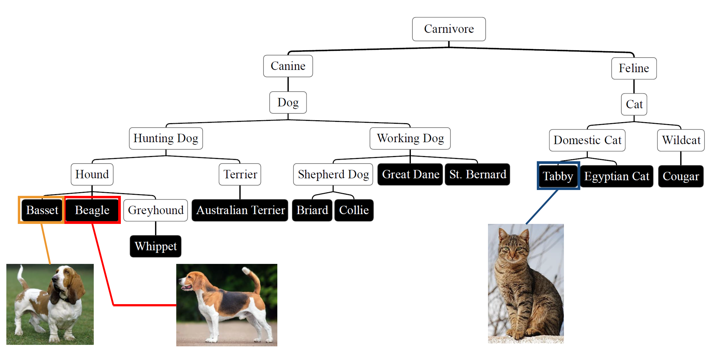
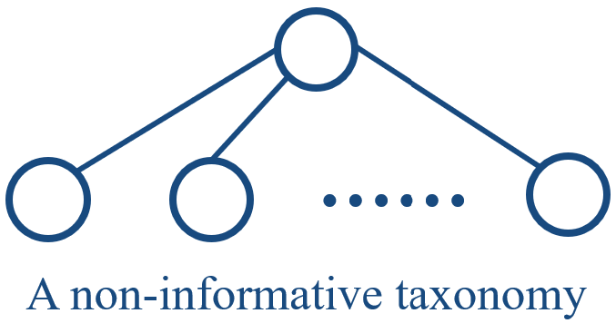
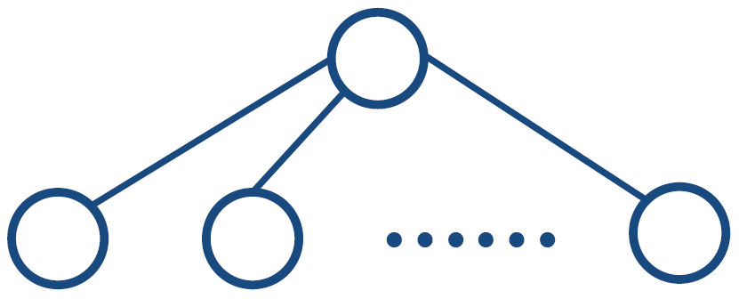
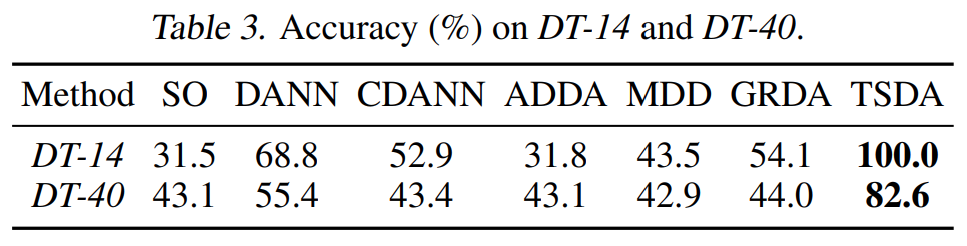
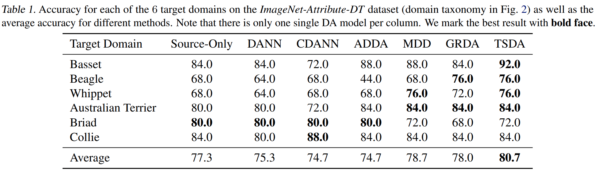
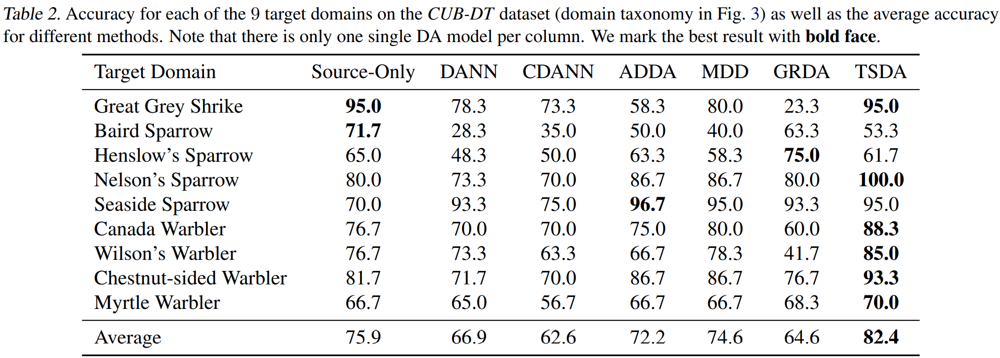

# Taxonomy-Structured Domain Adaptation (TSDA) (under construction)
This repo contains the code for our ICML 2023 paper:<br>
**Taxonomy-Structured Domain Adaptation**<br>
Tianyi Liu*, Zihao Xu*, Hao He, Guang-Yuan Hao, Guang-He Lee, Hao Wang<br>
*Fortieth International Conference on Machine Learning (ICML), 2023*<br>
[[Paper](https://arxiv.org/abs/2306.07874)] [[OpenReview](https://openreview.net/forum?id=ybl9lzdZw7)] [[PPT](https://shsjxzh.github.io/files/TSDA_5_minutes.pdf)] [[Talk (Youtube)](https://www.youtube.com/watch?app=desktop&v=hRWfAsi0Uks)] [[Talk (Bilibili)](https://www.bilibili.com/video/BV13g4y1A7Uq/?spm_id_from=333.999.list.card_archive.click&vd_source=38c48d8008e903abbc6aa45a5cc63d8f)]
<br>*"\*" indicates equal contribution.*<br>

## Outline for This README
* [Brief Introduction for TSDA](#brief-introduction-for-tsda)
* [Method Overview](#method-overview)
* [Theorem (Informal)](#theorem-informal-see-formal-definition-in-the-paper)
* [Installation](#installation)
* [Code for Different Datasets](#code-for-different-datasets)
* [Quantitative Result](#quantitative-result)
* [Related Works](#also-check-our-relevant-work)
* [Reference](#reference)

## Brief Introduction for TSDA
For classical domain adaptation methods such as DANN, they enforce uniform alignment to boost the generalization ability of models. However, recent studies have shown that, such uniform alignment can harm domain adaptation performance. To deal with this problem, we incorporate domain taxonomy into domain adaptation process. With domain taxonomy, we can **break** the uniform alignment in domain adaptation. The equilibrium recovers the classic adversarial domain adaptation’s solution if given a non-informative domain taxonomy (e.g., a flat taxonomy where all leaf nodes connect to the root node) while yielding non-trivial results with other taxonomies. See Figure 1 for an example.

<p align="center">

</p>
<p>
    <em>Figure 1. An example of using domain taxonomy to break the uniform alignment. For our model, the middle representation for basset and Beagle should be more similar than the one for basset and tabby.</em>
</p>

## Method Overview
 We build on the classic adversarial framework and introduce a novel taxonomist, which competes with the adversarial discriminator to preserve the taxonomy information. 


## Theorem (Informal, See Formal Definition in the Paper)

<!-- *Figure x. A non-informative taxonomy.* -->
<!-- <p align="right"> -->
<!-- <figure>
  
  <figcaption>Figure x. A non-informative taxonomy.</figcaption>
</figure>
</p> -->

* The introduction of the taxonomist prevents the discriminator from enforcing uniform alignment.
* TSDA can **recover DANN** with a non-informative taxonomy  (e.g., a flat taxonomy where all leaf nodes connect to the root node). Refer to the right Figure for an example of non-informative taxonomy.
* DANN with weighted pairwise discriminators can only produce uniform alignment.


## Installation
```python
conda create -n TSDA python=3.8
conda activate TSDA
conda install pytorch==1.11.0 torchvision==0.12.0 cudatoolkit=11.3 -c pytorch
pip install -r requirements.txt
```

## Code for Different Datasets
In the directory of each dataset, there are detailed steps on how to train VDI and how to visualize the inferred domain indices.
* [Experiments on Toy Datasets](Toy)
* [Experiments on Real Datasets](Real)

## Quantitative Result
#### Toy Datasets: DT-14 and DT-40
<p align="center">

</p>

#### ImageNet-Attribute-DT
<p align="center">

</p>

#### CUB-DT
<p align="center">

</p>


## Also Check Our Relevant Work
<span id="paper_1">[1]**Domain-Indexing Variational Bayes: Interpretable Domain Index for Domain Adaptation**<br>
Zihao Xu*, Guang-Yuan Hao*, Hao He, Hao Wang<br>
*Eleventh International Conference on Learning Representations, 2023*<br>
[[Paper](https://arxiv.org/abs/2302.02561)] [[OpenReview](https://openreview.net/forum?id=pxStyaf2oJ5&referrer=%5Bthe%20profile%20of%20Zihao%20Xu%5D(%2Fprofile%3Fid%3D~Zihao_Xu2))] [[PPT](https://shsjxzh.github.io/files/VDI_10_miniutes_2nd_version_to_pdf.pdf)] [[Talk (Youtube)](https://www.youtube.com/watch?v=xARD4VG19ec)] [[Talk (Bilibili)](https://www.bilibili.com/video/BV13N411w734/?vd_source=38c48d8008e903abbc6aa45a5cc63d8f)]

<span id="paper_2">[2] **Graph-Relational Domain Adaptation**<br></span>
Zihao Xu, Hao He, Guang-He Lee, Yuyang Wang, Hao Wang<br>
*Tenth International Conference on Learning Representations (ICLR), 2022*<br>
[[Paper](http://wanghao.in/paper/ICLR22_GRDA.pdf)] [[Code](https://github.com/Wang-ML-Lab/GRDA)] [[Talk](https://www.youtube.com/watch?v=oNM5hZGVv34)] [[Slides](http://wanghao.in/slides/GRDA_slides.pptx)]

<span id="paper_3">[3] **Continuously Indexed Domain Adaptation**<br></span>
Hao Wang*, Hao He*, Dina Katabi<br>
*Thirty-Seventh International Conference on Machine Learning (ICML), 2020*<br>
[[Paper](http://wanghao.in/paper/ICML20_CIDA.pdf)] [[Code](https://github.com/hehaodele/CIDA)] [[Talk](https://www.youtube.com/watch?v=KtZPSCD-WhQ)] [[Blog](http://wanghao.in/CIDA-Blog/CIDA.html)] [[Slides](http://wanghao.in/slides/CIDA_slides.pptx)] [[Website](http://cida.csail.mit.edu/)]

## Reference
[Taxonomy-Structured Domain Adaptation](https://arxiv.org/abs/2306.07874)
```bib
@inproceedings{TSDA,
  title={Taxonomy-Structured Domain Adaptation},
  author={Liu, Tianyi and Xu, Zihao and He, Hao and Hao, Guang-Yuan and Lee, Guang-He and Wang, Hao},
  booktitle={International Conference on on Machine Learning},
  year={2023}
}
```